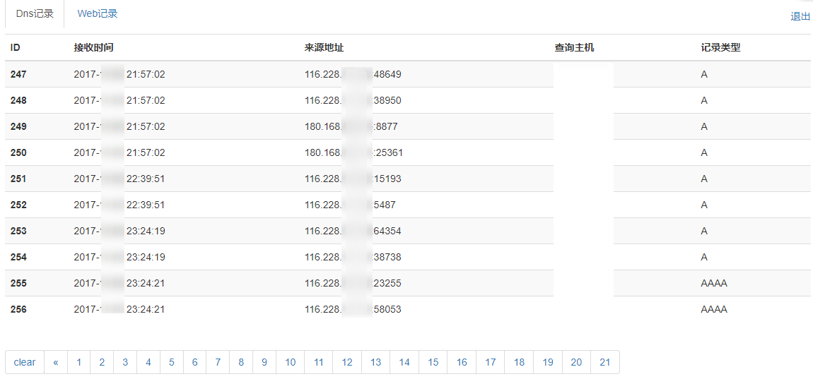

# logeyes

```
低配版dnslog平台, 根据 https://github.com/BugScanTeam/DNSLog 修改而来;
增加了Dns记录来源地址、Web记录来源地址的端口、请求方法、Cookie、Referer、X-Forwarded-For;
以后有时间增加更多功能的时候,也会更新至此.
```

-
## DNS记录：



## WEB记录：


## 部署:

一. 所需资源

```
两个域名
一个可控的VPS主机(带有一个固定外网IP地址)
```

如:

```
1. godaddy购买一个 test.com, 作为logeyes平台的域名;
2. 万网购买一个 mid.com, 作为假dns服务器导流域名;
3. 虚拟主机售卖平台购买一台稳定的VPS主机(假设其外网IP为2.2.2.2), 用来部署logeyes平台;
4. 万网域名解析配置面板, 配置ns1.mid.com和ns2.mid.com的A记录为2.2.2.2;
5. godaddy域名解析配置面板, 配置test.com使用自定义dns服务器,填入ns1.mid.com和ns2.mid.com。
```

二. 环境准备

一台安装好Ubuntu或Centos等Linux系统的VPS,上面安装设置好

```
nginx
python 2.7
pip
```

三. 平台搭建

可参考以下步骤:

```
1. 创建web根目录/path/to/web/logeyes/, 将logeyes目录中所有文件拷贝进去;
2. /path/to/web/logeyes/dnslog/setting.py文件, 修改下SECRET_KEY的值, 里面所有的test.com、mid.com、2.2.2.2替换为第一步的实际资源;
3. 目录切换到/path/to/web/logeyes/下,执行命令:
   pip install -r requirements.txt		    // 安装django
   python manage.py migrate				    // 生成sqlite3数据库和表
   python manage.py createsuperuser         // 创建自己的后台管理用户名和密码
   python manage.py makemigrations		    // 记录数据库数据更改
   python manage.py migrate				    // 确认更改
4. 修改/path/to/web/logeyes/nginx.conf文件中的access_log和error_log的存储位置, 将"web_root_path"替换为实际的web根目录;
5. 参考/path/to/web/logeyes/nginx.conf, 修改自己的nginx配置文件, 或直接用/path/to/web/logeyes/nginx.conf覆盖系统原始的nginx.conf文件;
```

四. 运行

```
1. 目录切换到/path/to/web/logeyes/,执行命令:
   python manage.py runserver 127.0.0.1:10101            // 10101端口对应nginx.conf里的设置
   service nginx start 或 nginx                          // 启动nginx
2. 浏览器访问
   http://test.com/logeyes/                              // 管理后台地址,用三.3中设置的口令登录,可增加普通用户和对应子域名
   http://logeyes.test.com/                              // 普通用户登录地址
```
注: 如遇到端口占用启动失败等,可用lsof -i:port命令,查看占用某端口的程序pid,kill掉进程,重新启动;


# dnstricker

```
logeyes平台的一部分，监听本地53/udp端口，用以模拟解析/响应dns请求，导引流量;
可以将所有请求自己子域名(原理图中为*.test.com)的dns请求记录下来，用来确定某处是否存在漏洞;
```
注: 程序兼容python2/3版本，可灵活扩展

-
## 原理图：


## 本地测试：

#### 1.由于在本地测试所以"域名服务商绑定IP"的操作，用修改本地HOSTS文件代替    
其中添加一行，即127.0.0.1 代指原理图中的1.1.1.1:

```
127.0.0.1 dns.mid.com
```

#### 2.使用命令开启模拟dns服务

```
python dnstricker.py
```

#### 3.使用如下命令测试

```
nslookup k1.test.com dns.mid.com
nslookup others.com dns.mid.com
nslookup k2.test.com dns.mid.com
```


#### 4.观察记录日志情况


#### 5.关键配置由程序中的下列参数指定

```
dns_domain = 'test.com'
ip_address = '2.2.2.2'
default_ip = '192.168.1.1'
```
注: 实际使用中，模拟dns服务和web服务一般部署在同一个服务器上，即dns服务回复给客户端的web服务的ip地址应为1.1.1.1，而不是原理图中的2.2.2.2
